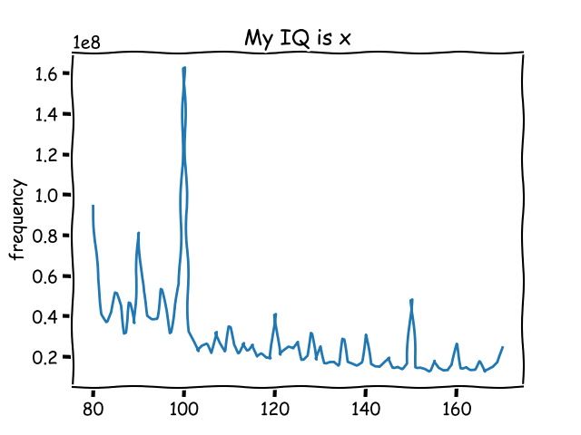

# XKCD-715
 Program to graph google results based on number included in search term

# Instructions
Call the program using the following command

```python main.py "searchterm" startNo stopNo interval```

The search term must include a %d where the number is supposed to go

## Example usage
```py main.py "My IQ is %d" 80 170 1```



## FIles
`main.py` -> Print each result to terminal, make graph

`russ.py` -> Don't print result to terminal, make graph 

### Support me: 

<a href="https://www.buymeacoffee.com/matseslats" target="_blank"></a>